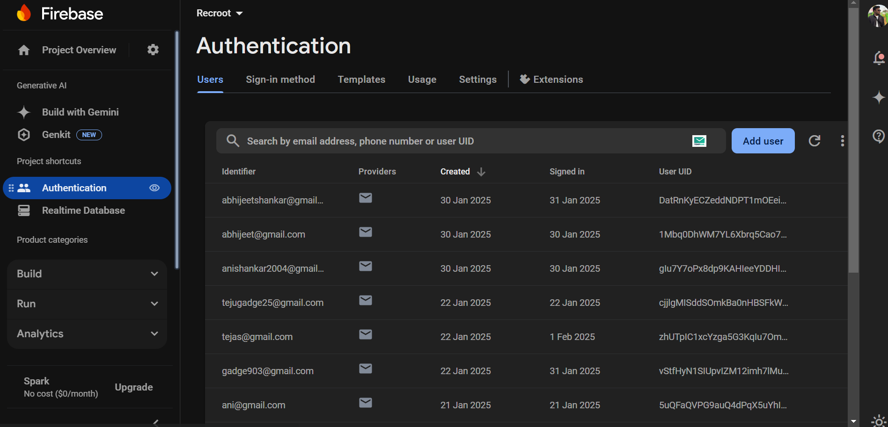

# 🚀 Recroot - Smart Applicant Tracking System (ATS)

<p align="center">
    
</p>


📺 **Watch the Demo:** [YouTube Video](https://www.youtube.com/watch?v=u7HGmPe94FI&feature=youtu.be)

**Recroot** is an advanced **Applicant Tracking System (ATS)** designed to streamline recruitment processes by automating **resume screening, job application tracking, interview scheduling, and offer letter management**.  

This documentation focuses on the **backend implementation, API development & deployment on Render, real-time database integration with Firebase, and resume storage using Cloudinary**.  

---

## 📌 Features  
✅ **ATS scoring** for resume-job description matching  
✅ **Job application tracking** for recruiters & candidates  
✅ **Automated interview scheduling** with notifications  
✅ **Smart feedback collection** from interviewers  
✅ **Offer letter management** and status tracking  
✅ **Resume storage on Cloudinary** for easy retrieval  
✅ **Real-time database on Firebase** for seamless data sync  

---

# 🎨 Frontend Overview  

## **🖥️ UI Screens**  
✅ **Login Page** - Secure authentication system  
✅ **Landing Page for Recruiters** - Manage job listings and applications  
✅ **Landing Page for Candidates** - Apply for jobs and track applications  
✅ **Landing Page for Interviewers** - Provide feedback and review candidates  

### **🔹 UI Screenshots**

| Candidate | Recruiter | Interviewer |
|-----------|----------|-------------|
|  |  |  |

---

## 🛠️ Tech Stack  

### **Backend**  
- **Backend Framework:** Flask  
- **Database:** Firebase (Real-time Database)  
- **Storage:** Cloudinary (Resume Storage)  
- **API Hosting:** Render  
- **Language:** Python  

### **Frontend**  
**Built with Flutter** 🚀 

#### **🔗 Flutter Plugins Used:**  
- [cupertino_icons](https://pub.dev/packages/cupertino_icons): ^1.0.6  
- [firebase_core](https://pub.dev/packages/firebase_core): ^3.10.1  
- [firebase_auth](https://pub.dev/packages/firebase_auth): ^5.4.1  
- [cloud_firestore](https://pub.dev/packages/cloud_firestore): ^5.6.2  
- [firebase_database](https://pub.dev/packages/firebase_database): ^11.3.1  
- [intl](https://pub.dev/packages/intl): ^0.20.2  
- [firebase_storage](https://pub.dev/packages/firebase_storage): ^12.4.1  
- [file_picker](https://pub.dev/packages/file_picker): ^8.1.7  
- [http](https://pub.dev/packages/http): ^1.3.0  
- [cloudinary](https://pub.dev/packages/cloudinary): ^1.2.0  
- [url_launcher](https://pub.dev/packages/url_launcher): ^6.3.1  
- [open_file](https://pub.dev/packages/open_file): ^3.0.3  
- [pdf](https://pub.dev/packages/pdf): ^3.10.8  
- [path_provider](https://pub.dev/packages/path_provider): ^2.1.5  

---

# ⚙️ Backend Overview  

## 👀 API Endpoints  

### 1️⃣ **Resume ATS Scoring API**  

**Endpoint:**  
```http
POST /ats-score
```
**Request Body (JSON):**  
```json
{
  "resume_url": "https://cloudinary.com/sample.pdf",
  "job_desc": "Software Engineer with experience in Python, Flask, and ML"
}
```
**Response (JSON):**  
```json
{
  "ats_score": 85.5
}
```
**Functionality:**  
- Downloads the resume from **Cloudinary**  
- Extracts text using **pdfplumber**  
- Computes similarity with **TF-IDF & Cosine Similarity**  
- Returns the **ATS Score**  

---

### 2️⃣ **Upload Resume to Cloudinary**  

**Endpoint:**  
```http
POST /upload-resume
```
**Request Body (Form Data):**  
- `resume_file`: (PDF file)  

**Response (JSON):**  
```json
{
  "resume_url": "https://res.cloudinary.com/.../resume.pdf"
}
```
**Functionality:**  
- Accepts a PDF file from the frontend  
- Uploads the resume to **Cloudinary**  
- Returns the **resume URL**  

---

### 3️⃣ **Job Application Data (Firebase Integration)**  

**Endpoint:**  
```http
POST /add-application
```
**Request Body (JSON):**  
```json
{
  "candidate_name": "John Doe",
  "email": "john@example.com",
  "job_role": "Software Engineer",
  "resume_url": "https://res.cloudinary.com/.../resume.pdf",
  "status": "Applied"
}
```
**Response (JSON):**  
```json
{
  "message": "Application added successfully"
}
```
**Functionality:**  
- Stores candidate job application data in **Firebase**  
- Tracks application **status updates** (Applied, Interview, Hired, Rejected)  

---

## 📂 Firebase Database Structure  

<p align="center">
    
</p>


---

## ☁️ Cloudinary Resume Storage  

  

---

# 🚀 Deployment Guide  

## **1️⃣ Backend API Deployment on Render**  

### **Step 1: Create a `requirements.txt` file**  
```txt
flask
requests
pdfplumber
scikit-learn
firebase-admin
cloudinary
gunicorn
```

### **Step 2: Create a `render.yaml` file**  
```yaml
services:
  - type: web
    name: recroot-api
    runtime: python
    envVars:
      - key: CLOUDINARY_URL
        value: "your-cloudinary-url"
      - key: FIREBASE_CREDENTIALS
        value: "your-firebase-admin-sdk.json"
    buildCommand: "pip install -r requirements.txt"
    startCommand: "gunicorn index:app"
```

### **Step 3: Push the project to GitHub**  
sh
git init
git add .
git commit -m "Initial commit"
git branch -M main
git remote add origin https://github.com/your-repo/recroot
git push -u origin main


### **Step 4: Deploy on Render**  
- Go to [Render](https://render.com/)  
- Click on **"New Web Service"**  
- Select your GitHub repo  
- Set the runtime to **Python**  
- Add necessary **environment variables**  
- Click **Deploy**  

---

## 2️⃣ Firebase Integration  

### **Step 1: Setup Firebase**  
- Go to [Firebase Console](https://console.firebase.google.com/)  
- Create a **new project**  
- Go to **Project Settings → Service Accounts**  
- Generate a **Private Key JSON** and download it  

### **Step 2: Install Firebase Admin SDK**  
sh
pip install firebase-admin


### **Step 3: Initialize Firebase in the Code**  
python
import firebase_admin
from firebase_admin import credentials, db

cred = credentials.Certificate("firebase-admin-sdk.json")
firebase_admin.initialize_app(cred, {
    'databaseURL': "https://your-database-url.firebaseio.com/"
})


### **Step 4: Storing Job Applications in Firebase**  
python
def store_application(data):
    ref = db.reference("/applications")
    ref.push(data)
    return {"message": "Application added successfully"}

---


# 🏆 Conclusion  

Recroot is an **Seamless hiring solution** that simplifies recruitment for companies. With **Cloudinary for resume storage, Firebase for real-time data, and Render for seamless API deployment**, Recroot is built for **scalability, efficiency, and automation**.  

🚀 **Get started today and make hiring hassle-free!**  

---

# 📌 Contact & Contribution  
👩‍💻 **Developed by:** [Tejas Gadge](https://github.com/tejasgadge2504)  & [Anisha Shankar](https://github.com/hahaanisha) 
💡 **Contribute:** Fork the repo & submit a PR!  
📧 **Feedback/Suggestions:** Open an issue on GitHub  

**⭐ Star the project if you found it useful! ⭐**
